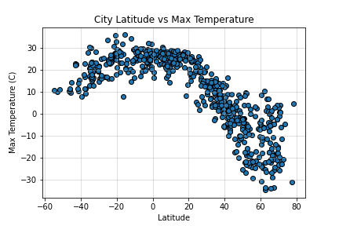
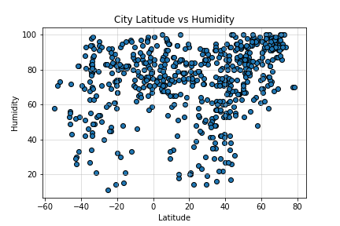
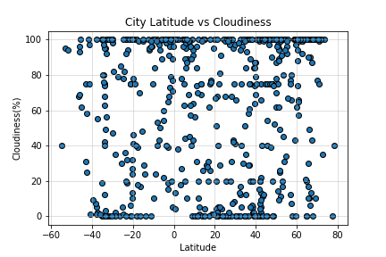
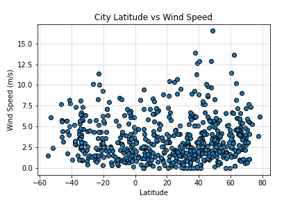
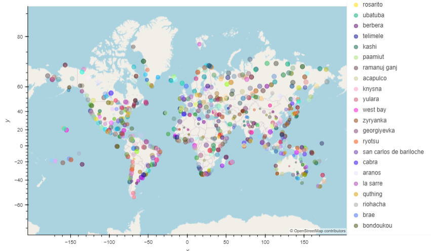
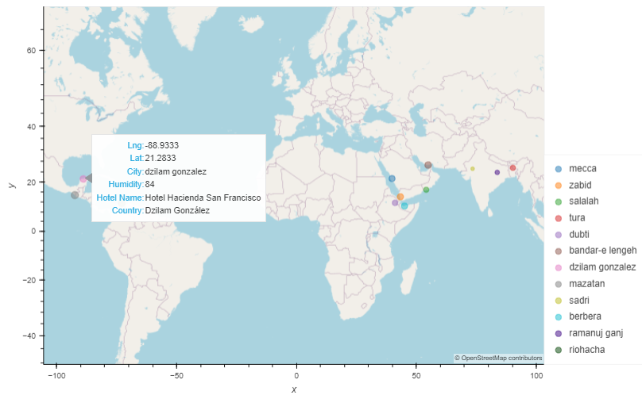

# python-api-challenge
## Module 6 Challenge
For this project I analyzed the weather of nearly 600 randomly generated cities in order to find out if their location could be influencing the cities weather. 

## Summary
When analyzing the data ....

## Latitude Vs Temperature

## Latitude Vs. Humidity

## Latitude Vs. Cloudiness

## Latitude Vs. Wind Speed

## Northern Latitude Vs. Max Temperature

## Southern Latitude Vs. Max Temperature

## Northern Latitude Vs. Humidity

## Southern Latitude Vs. Humidity

## Northern Latitude Vs. Cloudiness

## Southern Latitude Vs. Cloudiness

## Northern Latitude Vs. Wind Speed

## Southern Latitude Vs. Wind Speed

## City Map
Below is a map of all of the randomly generated cities. Each colored dot is a new city and the size of the dot is representative of the city's humidity.

## Ideal Weather Map
Below is a map of cities filtered to have ideal weather conditions. Added to the hover message on the interactive map is the name of the nearest hotel as well as the country the city is located in.

